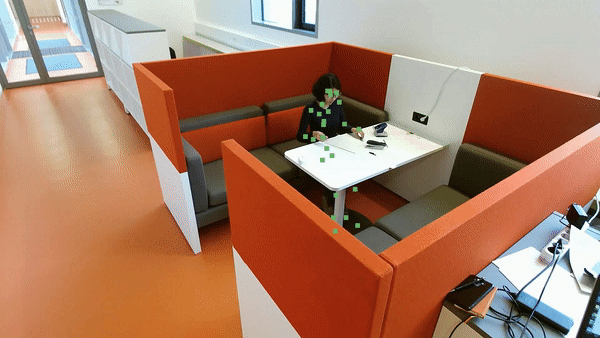
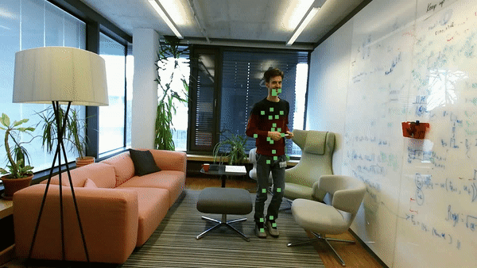
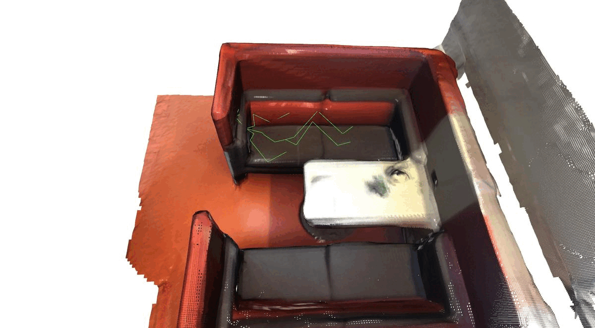
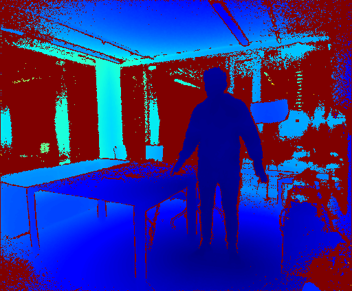

## Human Motion prediction with Scene Context

We sought to train a human motion predictor, taking a time sequence of a 25 joint skeleton and predicting future joint locations.

## PROX dataset
We used the [PROX datastet](https://prox.is.tue.mpg.de/) for training and validation. We originally wished to incorporate proximity maps as model inputs. These would provide scene context to inform better predictions (e.g. rolling around on a bed, sliding an arm across a table, leaning against a wall). But we ran out of time to adapt/train a joint model.

We made dataloaders for the various RGB image, Depth image, joint location files see [benji_prox_dataloader.py](./src/benji_prox_dataloader.py). To use you will have to download the dataset yourself and provide a local path to it.


## SMPLX model
The PROX dataset provides human joint locations (along with colour, depth images, scene meshes etc.) in the form of SMPLX parameters. We downloaded and placed a SMPLX model in `./models_smplx_v1_1` for working with this data, as well as visualisation.
See their [SMPLX website](https://smpl-x.is.tue.mpg.de/) for how to download


## Python Requirements
Installation of various packages is complicated, but roughly
```python
torch==1.10.0
torchvision==0.11.1
torchaudio
smplx[all]
open3d==0.9.0.0
```

On Euler cluster we used a virtual environment with loaded modules:
`gcc/6.3.0 python_gpu/3.8.5 cuda/10.2.89 mesa/18.3.6 open3d/0.9.0 eth_proxy`

## Results
We show some qualitative results on our validation set, which contains 9 videos in 2 scenes: N3OpenArea and BasementSittingBooth.
### RNN
On a 2 second motion prediction from 1 second of input joint locations with an RNN. Not very good motion prediction unfortunately, our history of model training was messy and ignorant. This is the best we achieved on a short time frame prediction, though we also tried to predict longer sequences which is harder.

Predicted Lying human to sit up


Human Walking


Assumes static standing human will start moving forwards - but has floating not walking feet


Some more examples from PROX dataset RGB camera point of view




### Transformer
The transformer model is able to predict natural human paths and shapes, but is unable to follow the trajectories accurately.



## Visualization
You can visualize skeletons in 2D and 3D with [benji_3d_skel_in_scene_vis.ipynb](./src/notebooks_neat/benji_3d_skel_in_scene_vis.ipynb)
, [visualise_model_preds.ipynb](./src/notebooks_neat/visualise_model_preds.ipynb).

See [proximity_map_demo.ipynb](./src/notebooks_neat/proximity_map_demo.ipynb) for loading proximity maps.

Here's a gif of what a time sequence of proximity maps looks like:



## Training models
Standalone scripts [rnn_gru_joints_worldnorm.py](./src/notebooks_neat/rnn_gru_joints_worldnorm.py) and [transformer_joints_worldnorm.py](./src/notebooks_neat/transformer_joints_worldnorm.py).

You can load with `pytorch` the best trained short 2 second prediction model at [model.pt](./src/notebooks_neat/GRU_joints_5_10_dual_5fps_2layers512__07_06_1053_epoch77_bn1577.pt)
```python
from pose_gru import PoseGRU_inputFC2
gru = PoseGRU_inputFC2(input_size=(25,3), n_layers=3)
restore_dict = torch.load(save_path, map_location=device)
gru.load_state_dict(restore_dict['model_state_dict'])
```

## Acknowledgments

Many thanks to Siwei Zhang for supervising our team for this course project, and to the TA team of the 2022 Virtual Humans course - lead by Siyu Tang.
